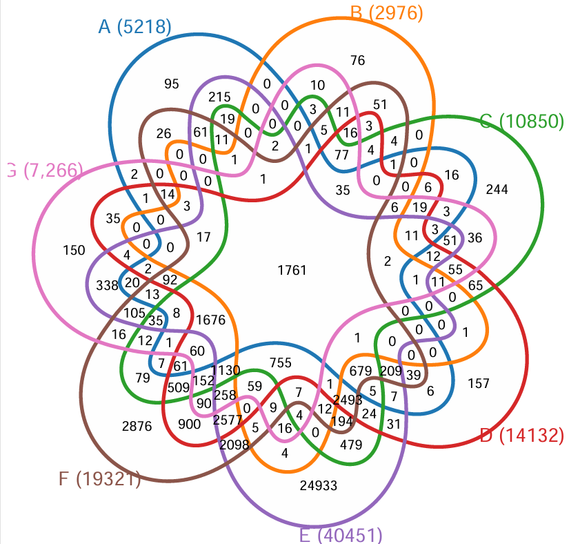

## 超过6个数据集的韦恩图（veen plot）绘制

### 这里使用的工具是发表在iMeta杂志上的ggVennDiagram [引用](https://doi.org/10.1002/imt2.177)

```r
install.packages("ggVennDiagram")
library(ggVennDiagram)

dataf = read.table('../data/seven_dataset.csv', sep = ',', header = 1)

# 这里是7个数据集，每个数据集为1列
colnames(dataf)
# [1] "A" "B" "C" "D" "E" "F" "G"

# 这里将数据集的名称和数据列对应起来
x <- list(`A (5218)`=dataf$A[dataf$A != ""],
          `B (2976)`=dataf$B[dataf$B != ""],
          `C (10850)`=dataf$C[dataf$C != ""],
          `D (14132)`=dataf$D[dataf$D != ""],
          `E (40451)`=dataf$E[dataf$E != ""],
          `F (19321)`=dataf$F[dataf$F != ""],
          `G (7,266)`=dataf$G[dataf$G != ""])

library(ggplot2)
ggVennDiagram(x, label = "count",label_alpha=0,label_geom='label',edge_size=1.5,
              set_size = 6,
              set_color = c("#1f77b4", "#ff7f0e", "#2ca02c", 
                            "#d62728", "#9467bd", "#8c564b", 
                            "#e377c2"))+#scale_fill_distiller(palette = "PiYG")
  scale_fill_gradientn(colours = c("white")) + theme(legend.position = '')
```

### 结果如下：


需要画图数据和原始代码，关注博主索取
